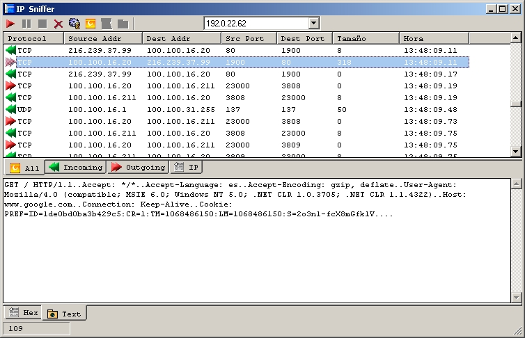



## RAW IP Sniffer

### Description

Updated.(21/nov/03)

Sniff all IP Packets in your PC using RAW sockets (needs windows 2000 or XP)

I´ve used a subclassing class posted here in PSC

Please comment and tell me what you think.
 
### More Info
 

             |
---                |---
**Submitted On**   |2003-11-17 19:48:48
**By**             |[MaRiØ G\. Serrano](https://github.com/Planet-Source-Code/PSCIndex/blob/master/ByAuthor/mari-g-serrano.md)
**Level**          |Advanced
**User Rating**    |5.0 (5 globes from 1 user)
**Compatibility**  |VB 6\.0
**Category**       |[Complete Applications](https://github.com/Planet-Source-Code/PSCIndex/blob/master/ByCategory/complete-applications__1-27.md)
**World**          |[Visual Basic](https://github.com/Planet-Source-Code/PSCIndex/blob/master/ByWorld/visual-basic.md)
**Archive File**   |[RAW\_IP\_Sni16744511212003\.zip](https://github.com/Planet-Source-Code/mari-g-serrano-raw-ip-sniffer__1-49879/archive/master.zip)

